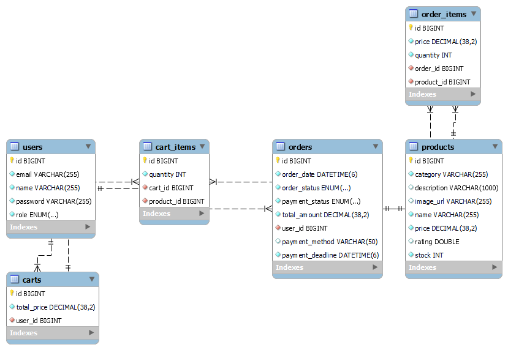

# E-Commerce Backend System
---

## Table of Contents

- [Project Overview](#-project-overview)
- [Core Engineering Problems Solved](#-core-engineering-problems-solved)
- [Tech Stack](#-tech-stack)
- [Getting Started](#-getting-started)
  - [Prerequisites](#prerequisites)
  - [Option 1 — Run with Docker (Recommended)](#option-1--run-with-docker-recommended)
  - [Option 2 — Run Locally](#option-2--run-locally)
- [API Documentation](#-api-documentation)
- [Database Schema](#-database-schema)
- [Running Tests](#-running-tests)

---

## Project Overview

A production-grade REST API backend for an e-commerce platform built with **Java 17** and **Spring Boot 3.5**. Designed with industry-standard layered architecture, JWT-based security, and Docker support for seamless deployment.

This system exposes REST APIs designed to be consumed by any web or mobile client.

**What's implemented:**

| Feature | Description |
|---|---|
| User Management | Registration, login, profile update, role-based access (ADMIN / CUSTOMER) |
| Product Management | Admin CRUD, public browsing with pagination and filtering by category or price |
| Shopping Cart | Add / remove / update items, auto total calculation, cart auto-created on first use |
| Order Management | Checkout converts cart to order, order history, admin status updates |
| Payment Simulation | 95% success rate simulation, stock reduced only on success |
| Inventory Management | Stock auto-reduced on payment success, out-of-stock orders blocked |
| Email Notifications | HTML confirmation email sent asynchronously on payment success |
| Security | JWT authentication, role-based route protection, entry point for 401/403 |
| Logging | Structured SLF4J logging across all services with file rotation |
| Documentation | Swagger UI with JWT auth support |
| Testing | Unit tests for all service and controller layers (JUnit 5 + Mockito) |
| Docker | Full containerization with docker-compose for app + MySQL |

---

## Core Engineering Problems Solved

These are real-world backend engineering challenges this project addresses — not just CRUD.

### 1. Ghost Inventory Problem
**Problem:** When a customer checks out, if they never complete payment, those items are "spoken for" but stock isn't reduced — causing phantom reservations.

**Solution:** A scheduled job (`OrderExpiryScheduler`) runs every 60 seconds and auto-cancels any `PENDING` order whose `paymentDeadline` (10 minutes after checkout) has passed. Stock is only reduced on confirmed payment success — never at checkout.

```
Checkout → Order PENDING (paymentDeadline = now + 10 min)
         ↓                              ↓
   Pay within 10 min           Don't pay in time
         ↓                              ↓
   Stock reduced              Scheduler auto-cancels
   Cart cleared               Stock untouched
```

### 2. Double Payment Prevention
**Problem:** A customer could hit the pay button twice or retry a paid order.

**Solution:** `PaymentService` checks `PaymentStatus` before processing. Only `PENDING` orders can be paid. `SUCCESS` or `FAILED` orders throw `IllegalStateException` immediately.

### 3. Price Snapshot on Checkout
**Problem:** If a product's price changes after a customer places an order, the order history would show the wrong price.

**Solution:** `OrderItem` stores the price at the time of checkout — a snapshot. Even if the product price changes later, the order record is immutable and accurate.

### 4. Stock Validation at Two Points
**Problem:** Stock could change between checkout and payment (another customer buys the last unit).

**Solution:** Stock is validated twice:
- At checkout — before creating the order
- At payment — just before processing, in case stock changed between the two operations

### 5. Cart Preserved on Payment Failure
**Problem:** If payment fails and the cart is already cleared, the customer has to re-add everything.

**Solution:** Cart is only cleared on `PaymentStatus.SUCCESS`. On failure, the cart stays intact so the customer can retry or place a new order immediately.

### 6. Async Email — Payment Never Blocked
**Problem:** If email sending fails or is slow, the payment response would be delayed or crash.

**Solution:** `EmailService.sendOrderConfirmationEmail()` is annotated with `@Async`. It runs in a background thread. The payment API returns immediately regardless of email outcome. Email failures are caught and logged at ERROR level — they never propagate to the payment response.

### 7. Unified API Response Structure
**Problem:** Inconsistent response shapes make frontend integration brittle — errors look different from successes.

**Solution:** Every API endpoint returns the same `ApiResponse<T>` wrapper:
```json
{
  "success": true,
  "status": 200,
  "message": "Order placed successfully",
  "data": { ... },
  "timestamp": "2024-01-15T11:00:00"
}
```

### 8. Ownership Enforcement Without Exposing Data
**Problem:** A customer requesting `GET /api/orders/5` where order 5 belongs to another user — should this return 403 or 404?

**Solution:** Returns `404 Not Found` (not 403). This prevents information leakage — the requester doesn't know order 5 exists at all. This is the correct security-first approach used by production APIs.

---

## Tech Stack

| Layer | Technology |
|---|---|
| Language | Java 17 |
| Framework | Spring Boot 3.5 |
| Security | Spring Security 6 + JWT (jjwt 0.11.5) |
| Database | MySQL 8.0 |
| ORM | Spring Data JPA + Hibernate |
| Mapping | ModelMapper 3.2 |
| Validation | Jakarta Bean Validation |
| Email | Spring Mail + Gmail SMTP |
| Documentation | SpringDoc OpenAPI (Swagger UI) 2.8.5 |
| Testing | JUnit 5 + Mockito |
| Logging | SLF4J + Logback |
| Containerization | Docker + Docker Compose |
| Build | Maven Wrapper (mvnw) |

---
 
## 🚀 Getting Started
 
- There are two ways to run this project. Choose one.
---
### Option 1 — Run with Docker (Recommended)
 - You only need Docker Desktop. Nothing else — no Java, no MySQL, no Maven.
 - Docker will set up everything inside containers automatically.
---
### Step 1 — Install Docker Desktop
Download and install from: https://www.docker.com/products/docker-desktop
After installing, open Docker Desktop and wait until you see:
```
Docker Desktop is running
```
You can verify by running:
```bash
docker --version
```
 
---
### Step 2 — Clone the Repository
```bash
git clone https://github.com/your-username/ecommerce-backend.git
cd ecommerce-backend
```
---
### Step 3 — Create the `.env` File
Paste this content into `.env` and replace the placeholder values:
 
```env
# ─── Database ───────────────────────────────────────────────────────
# These are credentials for the MySQL container Docker creates
# DB_PASSWORD and MYSQL_ROOT_PASSWORD MUST be the same value
DB_USERNAME=root
DB_PASSWORD=yourStrongPassword123
 
# ─── JWT ────────────────────────────────────────────────────────────
# Used to sign and verify JWT tokens
# Must be a Base64-encoded string of at least 32 characters
# You can generate one here: https://www.base64encode.org
# Or run: echo -n "your_secret_key_at_least_32_chars" | base64
JWT_SECRET=bXlWZXJ5U2VjcmV0S2V5MTIzNDU2Nzg5MGFiY2RlZmdoaQ==
JWT_EXPIRATION=1800000
 
# ─── Email ──────────────────────────────────────────────────────────
# Used to send order confirmation emails
# IMPORTANT: Do NOT use your real Gmail password here
# You need a Gmail App Password — see how to get one below
MAIL_USERNAME=your_email@gmail.com
MAIL_PASSWORD=your_16_character_app_password
 
# ─── App ────────────────────────────────────────────────────────────
APP_NAME=Ecommerce App
 
# ─── MySQL Container ────────────────────────────────────────────────
# Docker uses these to set up the MySQL container on first start
# MYSQL_ROOT_PASSWORD must match DB_PASSWORD above
MYSQL_ROOT_PASSWORD=yourStrongPassword123
MYSQL_DATABASE=ecommerce_db
```
 
> ⚠️ **`DB_PASSWORD` and `MYSQL_ROOT_PASSWORD` must be the exact same value.** If they differ, the app cannot connect to the database.
 
> ⚠️ **Never commit `.env` to GitHub.** It is already listed in `.gitignore`.
 
---
### Step 4 — How to Get a Gmail App Password
Your normal Gmail password will not work. Gmail requires an App Password for third-party apps.
 
1. Go to your Google Account: https://myaccount.google.com/security
2. Make sure **2-Step Verification is ON** (required)
3. Go to: https://myaccount.google.com/apppasswords
4. Under **Select app** → choose **Mail**
5. Under **Select device** → choose **Other** → type `Spring Boot`
6. Click **Generate**
7. Google shows a 16-character password like: `abcd efgh ijkl mnop`
8. Remove the spaces → `abcdefghijklmnop`
9. Paste it as `MAIL_PASSWORD` in your `.env`
 
> If you want to skip email for now, leave `MAIL_USERNAME` and `MAIL_PASSWORD` as placeholder values. The app will still run — email sending will just fail silently (it's async and won't crash anything).
 
---
### Step 5 — Start the Application
Open a terminal in the project root and run:
 
```bash
docker compose up --build
```
 
**What happens next:**
 
```
Docker reads docker-compose.yml
  ↓
Pulls MySQL 8.0 image from Docker Hub
  ↓
Starts MySQL container → creates ecommerce_db database
  ↓
Builds your Spring Boot app image
  → Copies source code into build container
  → Runs ./mvnw package (downloads deps + compiles)
  → First run: 5–10 minutes (deps cached after this)
  ↓
Starts Spring Boot container
  → Connects to MySQL
  → Hibernate creates all tables automatically
  → App starts on port 8080
```
 
---
 
### Step 6 — Verify It's Running
The app is fully running. Open your browser:
 
```
http://localhost:8080/swagger-ui.html
```
You should see the Swagger UI with all 5 API groups listed.
 
---
 
### Step 7 — Create an Admin User
 
By default all registered users are `CUSTOMER`. To test admin endpoints:
 
1. Register a user via `POST /api/users/register`
2. Open MySQL Workbench and connect to `localhost:3307` (port 3307, not 3306)
3. Run:
```sql
USE ecommerce_db;
UPDATE users SET role = 'ADMIN' WHERE email = 'your_email@example.com';
```
4. Login again to get a fresh token with the ADMIN role
 
---
 
## 💻 Option 2 — Run Locally (Without Docker)
 
**You need:** Java 17, MySQL 8.0, Git. No global Maven needed — the project includes `mvnw`.
---
 
### Step 1 — Install Prerequisites
 
| Tool | Download |
|---|---|
| Java 17 JDK | https://adoptium.net (download Temurin 17) |
| MySQL 8.0 | https://dev.mysql.com/downloads/mysql |
| Git | https://git-scm.com |
 
Verify installations:
```bash
java -version      # should show: openjdk 17...
mysql --version    # should show: mysql  Ver 8.0...
```
---
### Step 2 — Clone the Repository
 
```bash
git clone https://github.com/your-username/ecommerce-backend.git
cd ecommerce-backend
```
---
 
### Step 3 — Create the MySQL Database
Open **MySQL Workbench** or **MySQL CLI** and run:
```sql
CREATE DATABASE ecommerce_db;
```
Verify it was created:
```sql
SHOW DATABASES;
-- you should see ecommerce_db in the list
```
 
---
 
### Step 4 — Generate a JWT Secret
You need a Base64-encoded string as your JWT secret. Run this in your terminal:
 
**Git Bash / Linux / Mac:**
```bash
echo -n "ecommerce_super_secret_key_min_32_chars" | base64
```
 
**Windows PowerShell:**
```powershell
[Convert]::ToBase64String([Text.Encoding]::UTF8.GetBytes("ecommerce_super_secret_key_min_32_chars"))
```
Copy the output — you'll need it in the next step.
 
---
 
### Step 5 — Get a Gmail App Password
Similar to the Docker setup, you need a Gmail App Password for email functionality.
---
 
### Step 6 — Create `application.properties`
Create the file at this exact path inside the project:
```
src/main/resources/application.properties
```
 
```properties
spring.application.name=ecommerce-backend
server.port=8080
 
# ─── Database ──────────────────────────────────────────────────────
# Replace YOUR_MYSQL_PASSWORD with your MySQL root password
spring.datasource.url=jdbc:mysql://localhost:3306/ecommerce_db?createDatabaseIfNotExist=true&useSSL=false&serverTimezone=UTC
spring.datasource.username=root
spring.datasource.password=YOUR_MYSQL_PASSWORD
spring.datasource.driver-class-name=com.mysql.cj.jdbc.Driver
 
# ─── JPA / Hibernate ───────────────────────────────────────────────
# update = Hibernate auto-creates/updates tables on startup
# No SQL script needed — tables are created automatically
spring.jpa.hibernate.ddl-auto=update
spring.jpa.show-sql=true
spring.jpa.database-platform=org.hibernate.dialect.MySQLDialect
spring.jpa.open-in-view=false
 
# ─── JWT ───────────────────────────────────────────────────────────
# Paste the Base64 output from Step 4 here
jwt.secret=YOUR_BASE64_SECRET_FROM_STEP_4
jwt.expiration=1800000
 
# ─── Email (Gmail SMTP) ────────────────────────────────────────────
spring.mail.host=smtp.gmail.com
spring.mail.port=587
spring.mail.username=YOUR_GMAIL_ADDRESS
spring.mail.password=YOUR_APP_PASSWORD_FROM_STEP_5
spring.mail.properties.mail.smtp.auth=true
spring.mail.properties.mail.smtp.starttls.enable=true
spring.mail.properties.mail.smtp.starttls.required=true
 
# ─── App ───────────────────────────────────────────────────────────
app.name=Ecommerce App
 
# ─── Swagger ───────────────────────────────────────────────────────
springdoc.api-docs.path=/api-docs
springdoc.swagger-ui.path=/swagger-ui.html
springdoc.swagger-ui.tryItOutEnabled=true
 
# ─── Logging ───────────────────────────────────────────────────────
logging.level.root=WARN
logging.level.com.ecommerce.ecommerce_backend=INFO
logging.file.name=logs/ecommerce.log
```
 
---
 
### Step 7 — Run the Application
 - Open the Spring Boot application class `EcommerceBackendApplication.java` and run it. The first startup will take a few minutes as it downloads dependencies and sets up the database. You should see logs indicating successful startup and database connection.
---
 
### Step 8 — Verify It's Running
 
Open your browser:
```
http://localhost:8080/swagger-ui.html
```
 
You should see the Swagger UI with all 5 API groups.
 
---
 
### Step 9 — Create an Admin User
 
By default all registered users are `CUSTOMER`. To test admin-only endpoints:
 
1. Register a user via `POST /api/users/register` in Swagger
2. Open **MySQL Workbench** → connect to `localhost:3306`
3. Run this query:
```sql
USE ecommerce_db;
UPDATE users SET role = 'ADMIN' WHERE email = 'your_email@example.com';
```
4. Call `POST /api/users/login` again to get a fresh token with `ADMIN` role
5. Use that token in Swagger's **Authorize 🔒** button
 
---
 
## API Documentation
 
Full interactive documentation is available at:
```
http://localhost:8080/swagger-ui.html
```
 
**How to authenticate in Swagger:**
1. Call `POST /api/users/login` to get a JWT token
2. Click the **Authorize 🔒** button at the top right
3. Enter `Bearer <your_token>`
4. All protected endpoints will now work
 
### Quick API Reference
 
#### User APIs — `/api/users`
 
| Method | Endpoint | Auth | Description |
|---|---|---|---|
| POST | `/register` | Public | Register new customer |
| POST | `/login` | Public | Login, returns JWT token |
| GET | `/{id}` | CUSTOMER (own) / ADMIN | Get user profile |
| PUT | `/{id}` | CUSTOMER (own) / ADMIN | Update name / password |
| PATCH | `/{id}/role` | ADMIN only | Change user role |
| DELETE | `/{id}` | ADMIN only | Delete user |
| GET | `/` | ADMIN only | List all users |
 
#### Product APIs — `/api/products`
 
| Method | Endpoint | Auth | Description |
|---|---|---|---|
| GET | `/` | Public | List all products with pagination + filters |
| GET | `/{id}` | Public | Get single product |
| POST | `/` | ADMIN only | Create product |
| PUT | `/{id}` | ADMIN only | Update product |
| DELETE | `/{id}` | ADMIN only | Delete product |
 
**Product filter query params:**
```
GET /api/products?category=Electronics&minPrice=500&maxPrice=50000&page=0&size=10&sortBy=price&sortDir=desc
```
 
#### Cart APIs — `/api/cart`
 
| Method | Endpoint | Auth | Description |
|---|---|---|---|
| GET | `/` | CUSTOMER | View cart with totals |
| POST | `/add` | CUSTOMER | Add product to cart |
| PUT | `/update/{productId}` | CUSTOMER | Update item quantity |
| DELETE | `/remove/{productId}` | CUSTOMER | Remove product from cart |
 
#### Order APIs — `/api/orders`
 
| Method | Endpoint | Auth | Description |
|---|---|---|---|
| POST | `/checkout` | CUSTOMER | Convert cart to order |
| GET | `/` | CUSTOMER | View own order history |
| GET | `/{id}` | CUSTOMER (own) / ADMIN | Get single order |
| PUT | `/{id}/status` | ADMIN only | Update order status |
 
**Order status values:** `PLACED` → `SHIPPED` → `DELIVERED` or `CANCELLED`
 
#### Payment APIs — `/api/payments`
 
| Method | Endpoint | Auth | Description |
|---|---|---|---|
| POST | `/pay/{orderId}` | CUSTOMER | Process payment for an order |
| GET | `/status/{orderId}` | CUSTOMER | Check payment status |
 
**Payment request body:**
```json
{
  "paymentMethod": "UPI"
}
```
**Payment method values:** `CREDIT_CARD`, `DEBIT_CARD`, `UPI`, `NET_BANKING`
 
**Payment rules:**
- Cannot pay an already paid order
- Cannot pay after 10-minute payment deadline
- Can only pay your own order
- 95% simulated success rate
 
### Standard Response Format
 
Every API — success or error — returns this structure:
 
```json
{
  "success": true,
  "status": 200,
  "message": "Order placed successfully",
  "data": { ... },
  "timestamp": "2024-01-15T11:00:00"
}
```
 
---
 
## 🗄 Database Schema
 

 

 
### Key Relationships
```
users     ──< orders       (one user has many orders)
users     ──  carts        (one user has one cart)
carts     ──< cart_items   (one cart has many items)
products  ──< cart_items   (one product in many carts)
orders    ──< order_items  (one order has many items)
products  ──< order_items  (one product in many orders)
```
 
---
 
## 🧪 Running Tests
 
```bash
# Run all tests
./mvnw test
 
# Windows
mvnw.cmd test
```
 
Tests cover:
 
| Layer | Files | Tests |
|---|---|---|
| Service | AuthService, UserService, ProductService, CartService, OrderService, PaymentService | 38 tests |
| Controller | UserController, ProductController, CartController, OrderController, PaymentController | 34 tests |
| **Total** | **11 test files** | **72 tests** |
 
Test coverage: **~46%** — full service layer business logic covered.
 
**Note:** Controller tests require the H2 in-memory database. Add this to `src/test/resources/application.properties`:
```properties
spring.datasource.url=jdbc:h2:mem:testdb;DB_CLOSE_DELAY=-1
spring.datasource.driver-class-name=org.h2.Driver
spring.jpa.hibernate.ddl-auto=create-drop
jwt.secret=dGVzdFNlY3JldEtleUZvclRlc3RpbmdQdXJwb3NlT25seTEyMzQ1Njc4OTAxMjM0NTY=
jwt.expiration=86400000
app.name=TestApp
spring.mail.host=localhost
spring.mail.port=25
spring.autoconfigure.exclude=org.springframework.boot.autoconfigure.mail.MailSenderAutoConfiguration
```
 
---

## 📝 Notes

- `application.properties` and `.env` are **not committed** to this repository — they contain secrets
- All tables are auto-created by Hibernate on startup (`ddl-auto=update`) — no SQL scripts needed
- The payment simulation uses a 95% success rate — re-run the payment API if it fails
- A failed payment leaves the cart intact so the customer can retry
- PENDING orders that are not paid within 10 minutes are automatically cancelled by the scheduler
- Email requires a valid Gmail App Password — see Step 5 in the local setup guide

---
